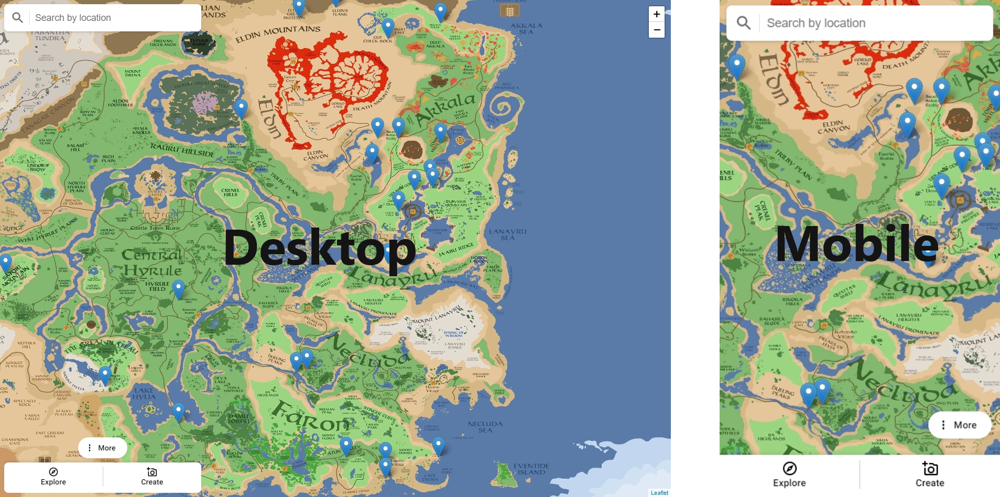
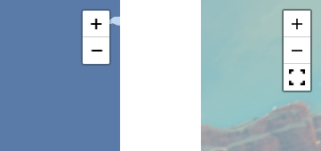
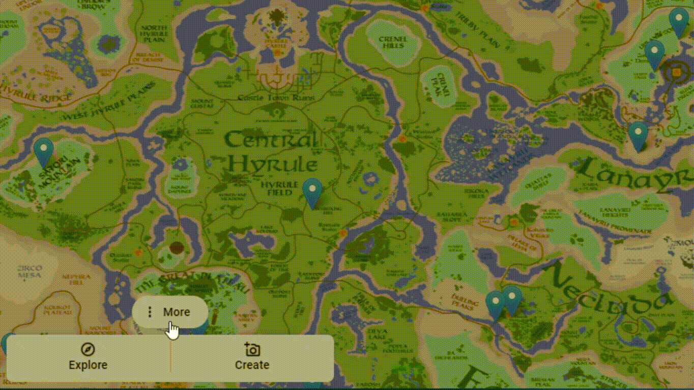
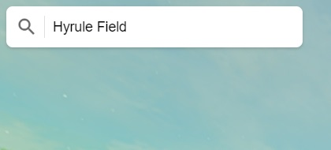

# Zelda BOTW Street View  

Este projeto é uma fork do [zeldabotwstreetview](https://github.com/nassimsoftware/zeldabotwstreetview) criado para implementar uma UI para dispositivos mobile e desktop semalhante ao Google Street View durante os estudos com o desenvolvimento web utilizando **HTML5, CSS3 e JavaScript**. Para criar o site foram utilizadas duas API's, sendo elas a [Leaflet](https://leafletjs.com/), utilizada para construção do mapa, e a [Pannellum](https://pannellum.org/documentation/api/), responsável por criar a visão panorâmica.

***
# 🛠 Melhorias e modificações realizadas

- [x] Criar nova UI
- [x] Implementar novos controles
- [x] Implementar animações
- [x] Implementar caixa de pesquisa
## ✔️ Implementação de uma nova UI
A nova interface conta apenas com as funcionalidades da página original, em que as principais modificações ocorreram em sua maioria no arquivo de estilo de página, priorizando a visão do mapa e da paisagem tanto no modelo desktop, quanto no modelo mobile.

    

## ✔️ Implementação de novos controles
Para padronizar os controles de zoom das duas API's, foram utilizados recursos de controles customizáveis da Pannellum, conforme a documentação apresentada nesse [link](https://pannellum.org/documentation/examples/custom-controls/).

    

## ✔️ Animações
Foram implementadas novas animações no menu, que apresenta o restante dos links e um video de demonstração, conforme a página original. 

## ✔️ Implementação da caixa de pesquisa
A caixa de pesquisa é a única funcionalidade adicional nessa versão. Ela funciona como uma caixa de pesquisa comum, onde basta digitar o nome do local que será redirecionado para a sua perspectiva panorâmica, caso já exista.

    

***
### 📚 Links e leitura recomendada 

* [Repositório original](https://github.com/nassimsoftware/zeldabotwstreetview)
* [website](https://nassimsoftware.github.io/zeldabotwstreetview)
* [YouTube Channel](https://www.youtube.com/watch?v=EYtB1rkwcfU)
* [API Leaflet](https://leafletjs.com/)
* [API Pannellum](https://pannellum.org/documentation/api/)
***

### 📝 Licença

Este projeto está sob a licença [GPL-3.0](https://github.com/JosManoel/zeldabotwstreetview/blob/implement_new_UI/LICENSE).